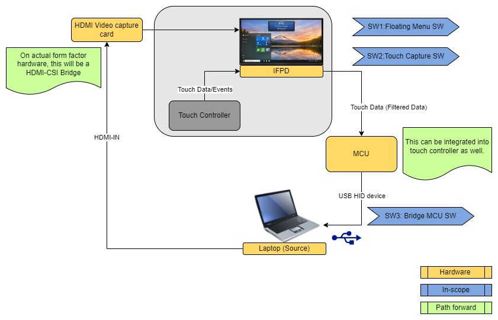

# IFPD Touch Back

[](https://dotnet.microsoft.com/)
[](https://www.espressif.com/en/products/socs/esp32-s3)
[](Apache-2.0.txt)

A complete solution to enable reverse touch / touch-back functionality for Interactive Flat Panel Displays (IFPD) with Intel Architecture (IA) platforms.

## 📋 Table of Contents

- [Overview](#overview)
- [Architecture](#architecture)
- [Components](#components)
- [System Requirements](#system-requirements)
- [Quick Start](#quick-start)
- [Documentation](#documentation)
- [Use Cases](#use-cases)
- [Contributing](#contributing)
- [License](#license)

## 🔍 Overview

This project enables touch input from an IFPD to be transferred to a connected computer, creating a seamless reverse touch experience. It consists of three main components:

1. **Touch Data Capture Service** (Windows) - Captures touch input from the IFPD
2. **MCU Firmware** (ESP32-S3) - Acts as a bridge, receiving touch data via UART and presenting it as USB HID
3. **Floating Menu Application** (Windows) - Provides a user-friendly interface for camera management and screen annotation

## 🏗️ Architecture

<div align="center">
	
</div>

## 📦 Components

### 1. Touch Data Capture Service (`Windows/GetTouchInfo`)

A Windows service that captures raw HID touch input and forwards it to the ESP32 via serial connection.

**Features:**
- Raw HID touch event capture
- High-speed serial communication (3 Mbaud)
- Dynamic coordinate scaling
- Process filtering
- Comprehensive logging

📖 [Full Documentation](Windows/GetTouchInfo/README.md)

### 2. MCU Firmware (`MCU`)

ESP32-S3 firmware that bridges UART touch data to USB HID multi-touch digitizer.

**Features:**
- 10-finger multi-touch support
- USB HID Digitizer protocol
- Low-latency dual-task architecture
- Windows Precision Touchpad compatible

**Supported Targets:** ESP32-S3

📖 [Full Documentation](MCU/README.md)

### 3. Floating Menu Application (`Windows/FloatingMenu`)

A WPF application providing an edge-docked floating menu for camera management and screen annotation.

**Features:**
- Edge-docked collapsible UI
- Camera detection and preview (OpenCV)
- Signal source management
- Screen annotation integration
- Always-on-top interface

📖 [Full Documentation](Windows/FloatingMenu/README.md)

## 💻 System Requirements

### Hardware
- **IFPD Device**: Interactive Flat Panel Display with touch support
- **ESP32-S3**: Development board with USB-OTG support
- **Target Computer**: Any Windows PC
- **Cables**: USB data cables, UART connection (TX/RX)

### Software
- **Windows 11** (for IFPD and Target Computer)
- **.NET 10 SDK** (for Windows applications)
- **ESP-IDF v5.x** (for MCU firmware)
- **Visual Studio 2022** or **Visual Studio Code** (optional)

## 🚀 Quick Start

### 1. Setup MCU Firmware

```bash
cd MCU
# Follow SETUP.md for ESP-IDF configuration
# Follow DEPLOYMENT.md for flashing
```

### 2. Build Windows Applications

```bash
cd Windows/GetTouchInfo
dotnet build
dotnet publish -c Release

cd ../FloatingMenu
dotnet build
dotnet publish -c Release
```

### 3. Deploy and Run

1. Flash the ESP32-S3 with the MCU firmware
2. Connect ESP32-S3 UART to IFPD's serial port
3. Run Touch Data Capture Service on the IFPD
4. Connect ESP32-S3 USB to Target Computer
5. Launch Floating Menu Application on the IFPD

## 📚 Documentation

Each component has detailed documentation in its respective directory:

- **[MCU README](MCU/README.md)** - ESP32-S3 firmware details
- **[MCU SETUP](MCU/SETUP.md)** - Development environment setup
- **[MCU DEPLOYMENT](MCU/DEPLOYMENT.md)** - Flashing and deployment guide
- **[Touch Service README](Windows/GetTouchInfo/README.md)** - Touch capture service details
- **[Floating Menu README](Windows/FloatingMenu/README.md)** - Floating menu application details

## 🎯 Use Cases

- **Presentation Mode**: Present from IFPD while controlling the connected laptop with touch
- **Remote Control**: Use IFPD as a large touch interface for a connected computer
- **Collaborative Work**: Share touch input across multiple devices
- **Interactive Displays**: Enable touch-back for IA-only IFPD systems

## 🤝 Contributing

Contributions are welcome! Please ensure:
- Code follows existing style conventions
- All components build without errors
- Documentation is updated accordingly

## 📄 License

This project is licensed under the Apache License 2.0. See [Apache-2.0.txt](Apache-2.0.txt) file for details


